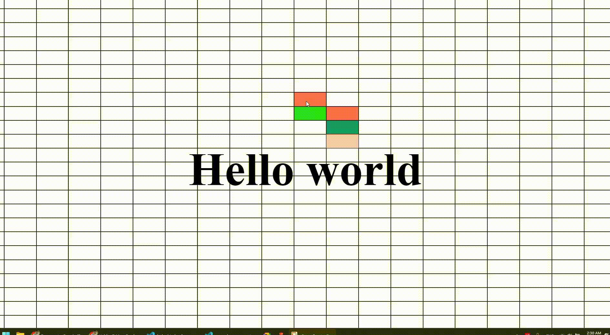

# my-web-components
A collection of web compoenents ive made


### Color-section


```html
<script src="./components/color-section.js"></script><!-- import the component-->

<!-- call compoenent like a normal element -->
<color-section class="<you can style it here>" colors="red, green, blue" block-x="3" block-y="4">
    <h1 slot="main" class="heading">Hello world</h1>
</color-section>
```
### explanation

this class is just likea normal **class**. the **colors** is to set a list of colors you want it to use **block-x/y** is percentage based sizing for the small boxes


